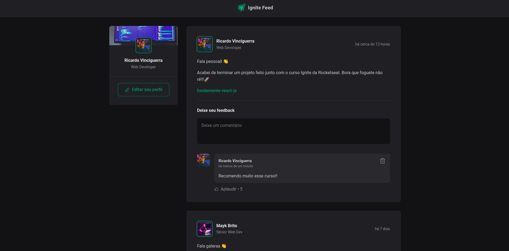

  
  <h1>Ignite Feed</h1>

## This website was created during the course Ignite to learn more about React JS

 

## 🧪 Technologies

This project was developed using de following technologies:

- [React](https://pt-br.reactjs.org/)
- [Date-fns](https://date-fns.org/)

## 🔖 Layout

You can view the project layout through the links below:

- [Layout](<https://www.figma.com/file/7M1imbEwKqqKXlfntqxoGJ/Ignite-Feed-(Community)?node-id=0%3A1&t=d9l0ugBIA5Vjsj0M-1>)

Remembering that you need to have a [Figma](http://figma.com/) account to access it.

 

Developed by [ricardorhv](https://github.com/ricardorhv) 👋
